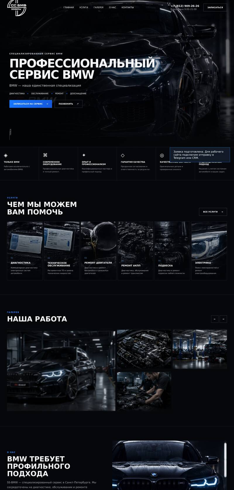
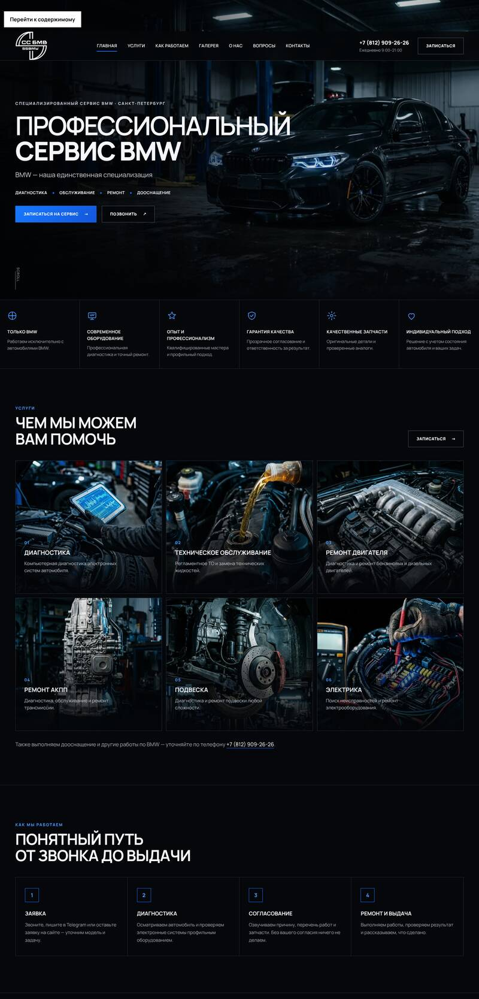

# Аудит сайта SS-BMW

Дата: 2026-10-01. Проведено два прохода: **аудит №1** (исходное состояние) → работы → **аудит №2** (проверка результата) → доработки.

| До | После |
|---|---|
|  |  |

---

## Аудит №1 — исходное состояние

### 1. Картинки («побились»)
| Проблема | Деталь |
|---|---|
| Крошечное разрешение | Все фото 195–896 px по ширине, а показываются на 1500 px → мыло. Hero — 896×352, фото услуг — 235×142. |
| Битые/«каша» кадры | `svc-1…svc-5`, `gal-5`, `gal-6` — результат неудачного апскейла (артефакты, рваные текстуры). Видны на сайте в блоке «Услуги». |
| Неверные форматы | `gal-1…6` — это PNG под расширением `.jpg`; браузеры иногда ругаются, CDN кэшируют неверно. |
| Мусор | `logo.jpg` (76 КБ) не используется; `gal-5`, `gal-6` не подключены; в README написано «фото с Pexels», хотя они лежат локально. |
| Нет размеров/lazy | Нет `width/height` (прыжки вёрстки), нет `loading="lazy"`, нет современных форматов. |

### 2. Структура проекта
* Весь CSS и JS — **минифицированные «простыни» в 1 строку**: невозможно читать и править.
* В CSS у `.service-card` ~10 дублирующихся/конфликтующих правил `background` (следы многократных правок).
* Ресурсы лежат плоско в `assets/` без разделения на фото/бренд/шрифты.
* Нет документации по структуре и по тому, как менять контент.

### 3. Баги интерфейса
* Галерея: 4 фото в сетке 3×2 → **пустая «дыра» справа**; стрелки «←/→» подменяют `src` у 4 из 6 картинок (на деле 2 лишние), без `aria-label`.
* Всплывающее уведомление (`toast`) частично торчало из-под нижнего края страницы.
* Кнопка «Все услуги» вела на форму, а не на список услуг.
* Загрузочный экран (loader) закрывал контент и задерживал показ ≈1.1 с, а при отключённом JS — навсегда.
* Hero появлялся с искусственной задержкой 0.45 с.
* Иконки преимуществ — Unicode-символы (◈ ⌘ ✦): на разных ОС выглядят по-разному, а на части — как «квадратики».

### 4. Форма заявки
* «Демо-форма»: данные **никуда не отправляются**, но пользователю показывается «заявка подготовлена». Реальные клиенты теряются.
* Нет маски/валидации телефона, `type="tel"`, `autocomplete`; нет согласия на обработку персональных данных (152-ФЗ).

### 5. SEO и узнаваемость
* Нет: favicon, Open Graph/Twitter-превью (ссылка в Telegram/ВК выглядит «голой»), canonical, JSON-LD (микроразметка организации), robots.txt, sitemap.xml, manifest, 404.
* `<title>` без города и ключевых слов («сервис BMW СПб»).
* Нет блока FAQ и «как мы работаем» — типичные запросы клиентов не закрыты.

### 6. Доступность и производительность
* Шрифт с Google Fonts (блокирует рендер, в РФ бывает недоступен) → самохостинг.
* Меню-бургер без `aria-expanded`, нет «skip link», нет `:focus-visible`, нет `prefers-reduced-motion`.
* Мелкий текст 10–11 px (описания, подписи) — плохо читается на телефоне.
* Нет липкой панели «Позвонить/Telegram» на мобильных — главный способ связи для автосервиса.

---

## Что сделано (комплекс работ №1)

1. **Новые изображения** (1376 px для hero/галереи, 640×800 для услуг), единый стиль: тёмный сервис, синие акценты. Формат WebP, `srcset` для hero, `width/height`, `lazy`.
2. **Новая структура** проекта (см. README), читаемые `css/styles.css` и `js/main.js` с оглавлением и комментариями.
3. **Бренд и узнаваемость:** фавикон + apple-touch-icon + PWA-иконки, OG-картинка 1200×630, `theme-color`, JSON-LD `AutoRepair` (адрес, телефон, часы работы) → расширенный сниппет в Яндексе/Google.
4. **Новые блоки:** «Как мы работаем» (4 шага), FAQ, расширенный блок контактов с кнопкой «Маршрут в Яндекс Картах», липкая мобильная панель.
5. **Форма:** маска телефона, валидация, выбор услуги (подставляется по клику на карточку), согласие, honeypot от ботов. Работает в двух режимах: через ваш обработчик (`data-endpoint`) либо — по умолчанию — открывает Telegram с готовым текстом заявки (см. [FORM-SETUP.md](FORM-SETUP.md)).
6. **Исправлены баги**: галерея (сетка + лайтбокс вместо подмены `src`), toast, loader, иконки (inline SVG), ссылки кнопок.
7. **Доступность/скорость:** шрифт Manrope self-hosted (кириллица+латиница), preload hero и шрифта, skip-link, aria-атрибуты, focus-стили, reduced-motion, минимальный размер текста 12–14 px.

---

## Аудит №2 — проверка результата

Проверено автоматически (headless Chromium) и вручную:

| Проверка | Результат |
|---|---|
| Все локальные ресурсы существуют; битых якорей/дубликатов `id` нет | ✅ |
| Битых картинок / `` без `alt` | 0 / 0 |
| Ошибки JS в консоли | 0 |
| Горизонтальный скролл и выход элементов за экран на 320, 360, 390, 768, 1024, 1280, 1440, 1920 px | ✅ после правок (см. ниже) |
| Контраст текста (WCAG AA ≥ 4.5): серый/фон 8.9, синий акцент/фон 6.9, белый на синей кнопке 6.2 | ✅ |
| Форма: пустая/неполная → понятные ошибки, маска `+7 (921) 555-12-34`, согласие, предвыбор услуги | ✅ |
| Меню: открывается/закрывается, `aria-expanded` обновляется, Esc закрывает | ✅ |
| Лайтбокс галереи: открывается, закрывается по Esc | ✅ |
| Вес первого экрана: hero 74 КБ + шрифты + логотип (было: hero 77 КБ при 896 px, логотип 55 КБ) | ✅ |
| Внешние зависимости | только Яндекс.Карты и Telegram |

### Найдено на аудите №2 и исправлено (комплекс работ №2)
* **Мобильный hero:** слово «ПРОФЕССИОНАЛЬНЫЙ» и теги вылезали за экран (скрыто `overflow:hidden`) → адаптивный размер заголовка, ограничение ширины; на 320 px — отдельный размер.
* **320 px:** блок преимуществ «выпирал» из-за длинных слов → `min-width:0`, `overflow-wrap`.
* **Широкие экраны (1920):** левый край hero/шапки не совпадал с контентом → единая переменная `--edge`.
* **Лишний вес:** неиспользуемый файл, PNG-логотип 55 КБ заменён на WebP 20 КБ (PNG оставлен для OG/404).
* **Ошибка при подготовке hero:** кадр зеркально отражён по ошибке и закрывался текстом — откат, проверено на скриншотах.

---

## Что осталось и рекомендации (по приоритету)

### 🔴 Сделать в первую очередь
1. **Настоящие фото вашего сервиса, мастеров и работ.** Сейчас картинки — ИИ-иллюстрации в фирменном стиле. Для доверия (а это главное в автосервисе) лучше 6–10 реальных фото: бокс, команда, до/после, чек-листы диагностики. Замените файлы в `assets/img/` с теми же именами; в галерею можно добавлять `<figure>` по образцу.
2. **Подключить реальную отправку заявок** (Telegram-бот/CRM) — инструкция в [FORM-SETUP.md](FORM-SETUP.md), нужно вписать URL в `data-endpoint`.
3. **Свой домен** (например, `ss-bmw.ru`): заменить URL в `index.html` (canonical, og:image, JSON-LD), `robots.txt`, `sitemap.xml`; в GitHub Pages указать custom domain.
4. **Яндекс Бизнес + Google Business Profile + 2ГИС**: карточка организации с теми же названием, адресом и телефоном (NAP) — главный драйвер локального поиска «сервис BMW СПб».
5. **Страница «Политика обработки персональных данных»** с реквизитами организации (ИП/ООО, ИНН) и ссылка на неё из чекбокса формы — это юридическое требование.

### 🟡 Важно для роста
6. **Логотип.** В нынешнем виде читается как «СС БМВ / SSBMW» (кириллица + латиница), а на сайте и в тексте — «SS-BMW». Это путает и мешает запоминанию. Рекомендуем единое написание **SS-BMW** и чистую векторную (SVG) версию логотипа; её же — на вывеску, форму, соцсети.
7. **Яндекс.Метрика** (в `main.js` уже готовы цели: `hero-call`, `hero-booking`, `dock-call`, `dock-telegram`, `dock-booking`, `form-submit`; достаточно добавить счётчик и `window.YM_ID = ...`).
8. **Отзывы** (реальные, со ссылкой на Яндекс Карты), **цены «от»** на основные услуги, **гарантийные сроки**, **список моделей/кузовов (E/F/G)** — это сильно повышает конверсию. Выдумывать эти данные мы не стали — нужны ваши реальные цифры.
9. **Отдельные страницы услуг** (`/diagnostika-bmw`, `/remont-akpp-bmw` …) — под каждый поисковый запрос; сейчас всё на одной странице.
10. **Мессенджеры:** добавить WhatsApp/MAX и VK-группу, если ведёте; ссылки в шапке/футере и в `sameAs` JSON-LD.
11. **Точные координаты** адреса в карте (метка `pt=` вместо текстового поиска) и ссылки «в 2ГИС/Google Maps».

### 🟢 Позже
12. Видео-ролик (30–40 с) «как проходит диагностика» в hero или в «О нас».
13. Блог/статьи («частые неисправности N47/N57/B58», «когда менять масло в АКПП ZF»): трафик из поиска.
14. Сборка (Vite/Eleventy) и CI с проверкой ссылок — нужна, когда страниц станет больше 3–4.
